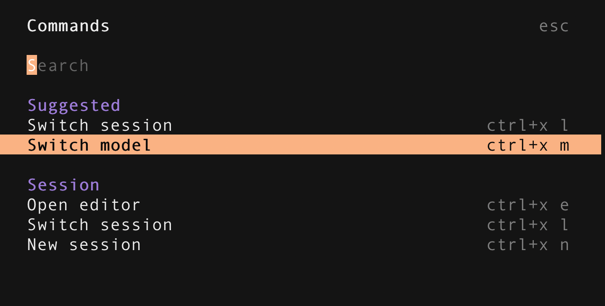
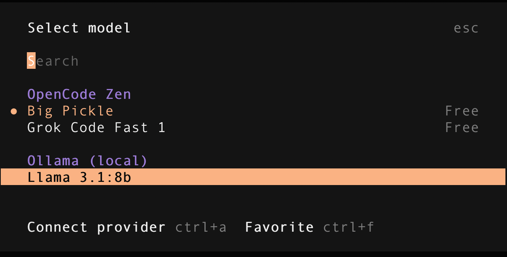

**Uso de agentes**

OPEN CODE
Instalamos open code y lo copiamos en el PATH:
```
docker exec -ti ollama bash
```

```bash
curl -fsSL https://opencode.ai/install | bash
cp /root/.opencode/bin/opencode /usr/local/bin/
```

Abrimos opencode:
```
opencode
```

Nos abre una terminal que tira del agente **Big Pickle**

Con el tabulador vamos cambiando de Plan (para planificar sin ejecutar) a Build (para ejecutar).

Le podemos pedir acciones y nos las hace, pero se conecta a internet y consume créditos (pendiente de probar y documentar)

Lo podemos conectar a otros LLM incluso locales, en https://opencode.ai/docs/providers/ tenemos la lista

Vamos a conectar con el LLM local:

Documentación:

https://opencode.ai/docs/providers/#ollama

Usamos el fichero opencode.json
```json
{
    "$schema": "https://opencode.ai/config.json",
    "provider": {
        "ollama": {
            "npm": "@ai-sdk/openai-compatible",
            "name": "Ollama (local)",
            "options": {
                "baseURL": "http://localhost:11434/v1"
            },
            "models": {
                "llama3.1:8b": {
                    "name": "Llama 3.1:8b"
                }
            }
        }
    }
}
```
Ejecutamos opencode apuntando al directorio de proyecto donde tenemos el fichero de configuración.
```bash
opencode /app/lecciones/leccion03
```

Pulsamos ctrl+p y seleccionamos provider:



Seleccionamos nuestro modelo LLM en local:



Como ollama es solo un LLM, no nos hará ninguna acción.